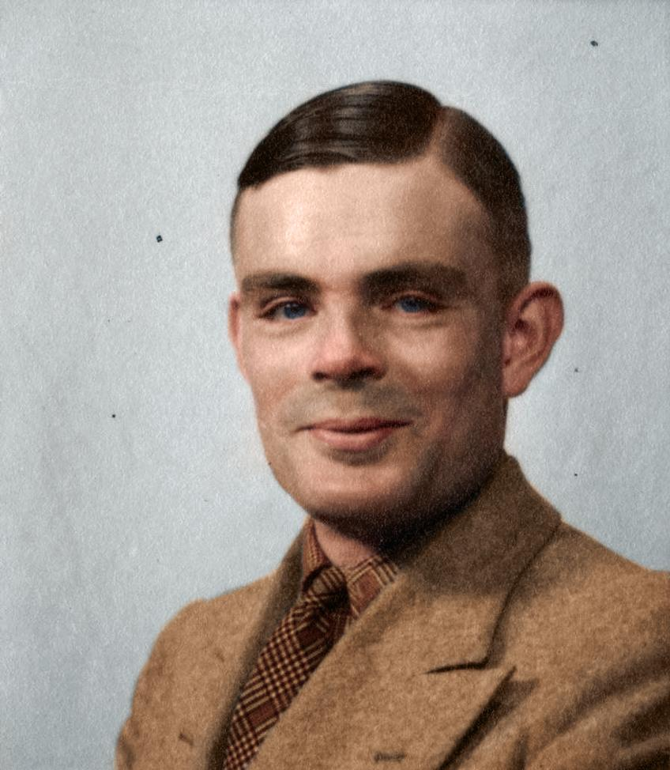
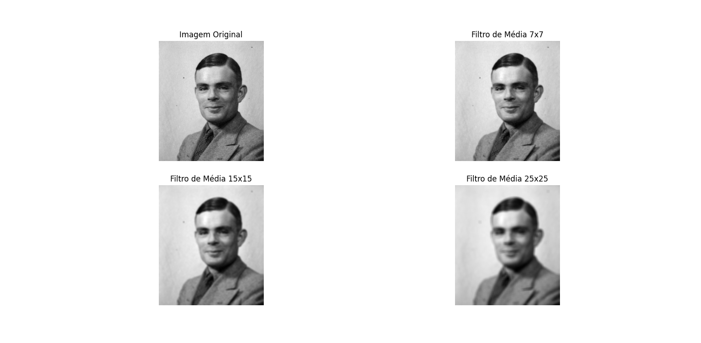
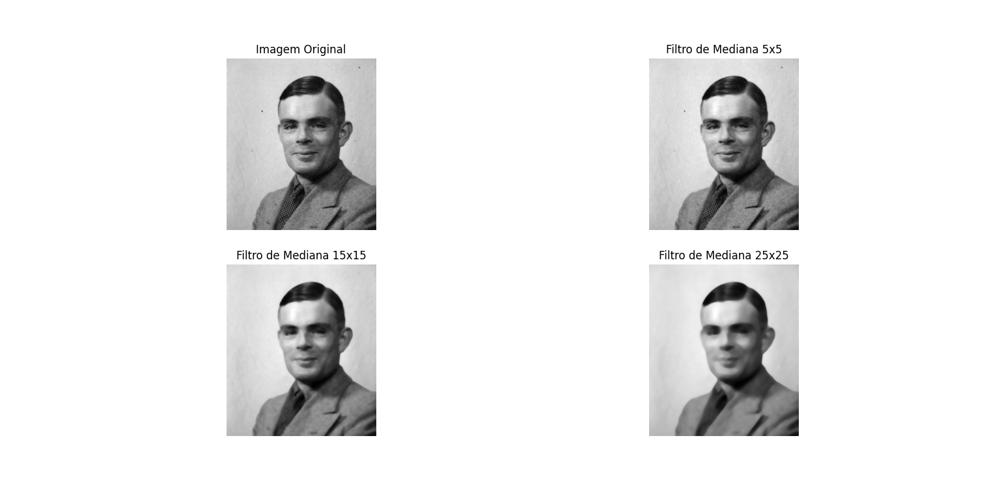
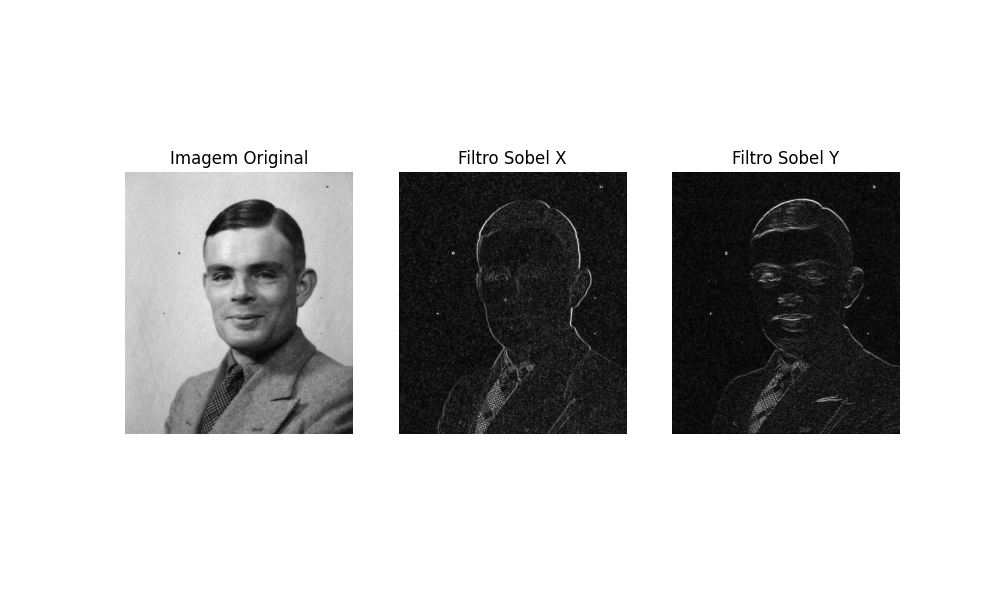
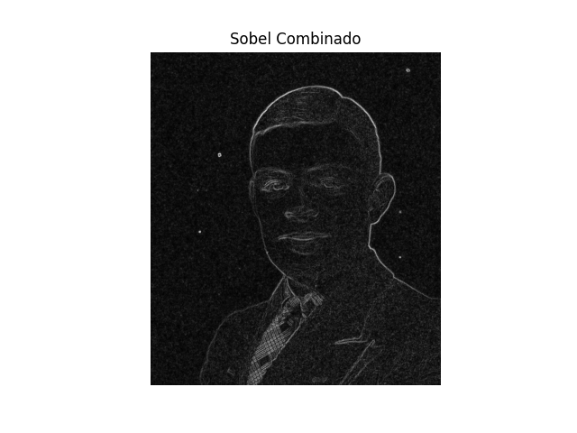
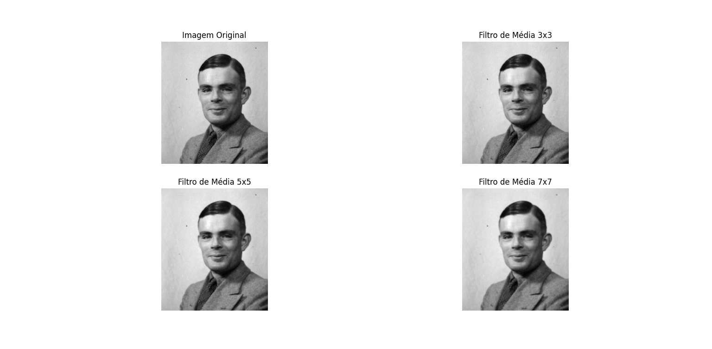
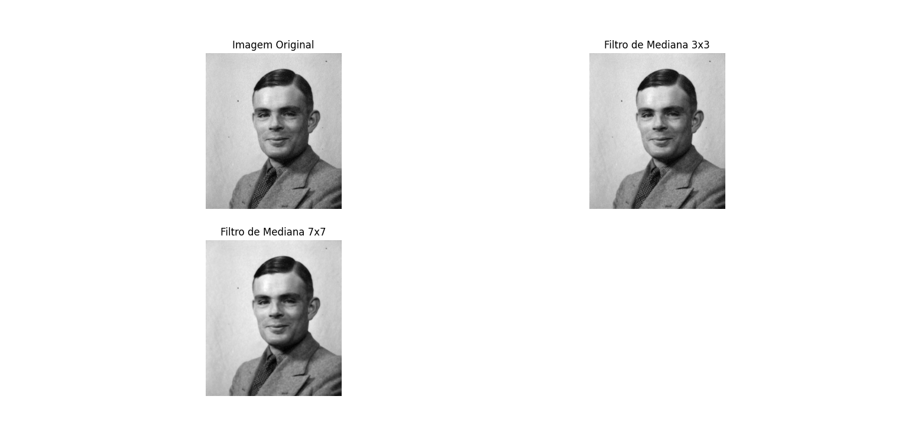

# Computação Gráfica e Processamento de Imagens

## Processamento Digital de Imagens - Unidade 4, seção 4.1  


## Descrição

Este projeto tem como objetivo, realizar o carregamento de uma imagem e aplicar diferentes filtros gráficos para então observar e analisar as alterações resultantes. Os filtros aplicados foram: **Média**, **Mediana** e **Sobel**. Além disso, também foi proposto experimentar diferentes tamanhos de Kernel para os filtros de média e mediana, avaliando como isso afeta a suavização da imagem. Todos os códigos podem ser conferidos neste mesmo repositório.

### 1. Carregamento de Imagem:

**Imagem Original**



### 2. Aplicação dos Filtros:

- **Filtro de Média:** Suaviza a imagem aplicando uma média ponderada, quanto maior a intensidade do filtro, maior é a suavização.
- **Filtro de Mediana:** Suaviza a imagem substituindo cada pixel pela mediana dos pixels vizinhos.
- **Filtro Sobel:** Destaca as bordas na imagem.

### 3. Análise dos Resultados:
**a) Como a imagem original mudou após a aplicação de cada filtro?**
- **Filtro de Média:**
  - A imagem original foi suavizada, resultando em uma redução geral do ruído presente. No entanto, as bordas dos objetos na imagem tornaram-se menos nítidas devido ao efeito de desfoque causado pela média ponderada.
  
- **Filtro de Mediana:**
  - A imagem apresentou uma suavização eficaz, especialmente na remoção de ruídos do tipo "sal e pimenta". As bordas foram preservadas de forma mais eficaz em comparação com o filtro de média, mantendo a definição dos contornos dos objetos.
  
  
- **Filtro Sobel:**
  - As bordas na imagem foram destacadas de maneira significativa. O filtro Sobel realçou os contornos e detalhes estruturais, facilitando a identificação de bordas e formas na imagem.
  
  

**b) Qual filtro foi mais eficaz para suavizar a imagem?**

O _Filtro de Mediana_ foi o mais eficaz na suavização da imagem. Ele reduziu os ruídos sem comprometer as bordas dos objetos, proporcionando uma imagem mais limpa e preservando os detalhes.

**c) E qual foi mais eficaz para destacar as bordas?**

O _Filtro Sobel_ foi o mais eficaz para destacar as bordas na imagem. Ele realçou de forma bem marcante os contornos dos objetos, facilitando a detecção das bordas e a visualização das formas.

**d) Quais situações podem exigir o uso de cada tipo de filtro em um projeto real?**

- **Filtro de Média:** Ideal para cenários onde a redução geral de ruído é necessária sem a necessidade de preservar bordas nítidas. Exemplos incluem imagens médicas, de satélite ou qualquer aplicação onde a suavização é prioritária.
- **Filtro de Mediana:** Excelente para remover ruídos do tipo "sal e pimenta" mantendo as bordas dos objetos. É amplamente utilizado em processamento de fotos digitais, onde a preservação de detalhes é importante.
- **Filtro Sobel:** Muito utilizado em visão computacional para tarefas como detecção de bordas, reconhecimento de objetos e análise de formas. Também é utilizado em processamento de imagens para realçar contornos e melhor a segmentação de imagens.


## Experimentação

- **Filtro de Média:** Ao utilizar os kernels 3x3, 5x5 e 7x7, podemos observar que a suavização foi bem mais leve. 

  

- **Filtro de Mediana:** Com a utilização dos kernels 3x3 e 7x7 podemos verificar a remoção eficaz de ruídos menores (sal e pimenta), e também a preservação das bordas.

  


---

### Tecnologias Utilizadas

- **Linguagem de Programação:** Python 🐍
- **Bibliotecas:**
  - **OpenCV** para processamento de imagens.
  - **NumPy** para manipulação de arrays.
  - **Matplotlib** para vizualização de imagens.

### Instalação

**1. Clone o repositório:**
```bash
git clone https://github.com/PedroAugusto2305/processamento-de-imagens.git
```
**2. Acesse o diretório do projeto:**
```bash
cd processamento-de-imagens
```

**3. Crie um ambiente virtual (opcional, mas recomendado):**
```bash
python -m venv filtros
```

**4. Instale as dependências:**
```bash
pip install -r requirements.txt
```

### Uso

**1. Prepare uma imagem:** escolha uma imagem para testar o uso dos filtros. 

**2. Execute o script:**
```bash
python nome-do-arquivo.py
```
**3. Visualize os resultados:** os resultados poderão ser vistos e comparados com a imagem original.
